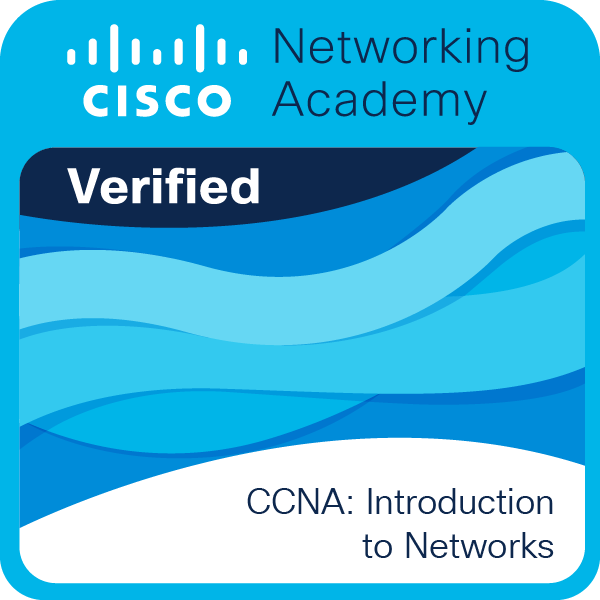

  

---

### ℹ Infos

- 🌍  São Paulo, SP, Brasil
- ✉️  Email: [kaua.souza.santosc@gmail.com](mailto:kaua.souza.santosc@gmail.com)

### ☕ Linguagens

### 🌐 Redes

 <a href="https://www.github.com/SouzaSantosK" target="_blank" rel="noreferrer"> <picture> <source media="(prefers-color-scheme: dark)" srcset="https://raw.githubusercontent.com/danielcranney/readme-generator/main/public/icons/socials/github-dark.svg" /> <source media="(prefers-color-scheme: light)" srcset="https://raw.githubusercontent.com/danielcranney/readme-generator/main/public/icons/socials/github.svg" />  </picture> </a> <a href="https://www.linkedin.com/in/souzasantosk" target="_blank" rel="noreferrer"> <picture> <source media="(prefers-color-scheme: dark)" srcset="https://raw.githubusercontent.com/danielcranney/readme-generator/main/public/icons/socials/linkedin-dark.svg" /> <source media="(prefers-color-scheme: light)" srcset="https://raw.githubusercontent.com/danielcranney/readme-generator/main/public/icons/socials/linkedin.svg" />  </picture> </a>

### 📊 Estatísticas

### Badges (Credly)

