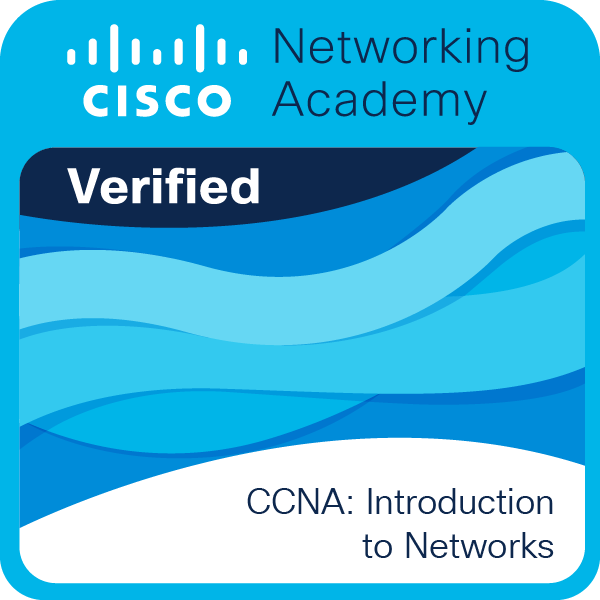

<h1> Olá, bem-vindo!</h1>

Bem vindo ao meu perfil do github. Sou estudante de redes, infraestrutura e programação. Atualmente estudando Python, e aprimorando minhas habilidades em administração de redes e automação.
Obrigado por visitar e sinta-se livre para se [conectar](https://www.linkedin.com/in/souzasantosk/)!

## ℹ Infos

- 🌍 São Paulo, SP, Brasil
- ✉️ [kaua.souza.santosc@gmail.com](mailto:kaua.souza.santosc@gmail.com)
- 💻 Cursando Redes de Computadores
- 🛜 Cisco CCNA 1, 2 e 3 v7
- ☁️ Azure AI-900 e DP-900
- ☁️ AWS Cloud Practitioner

## ☕ Ferramentas que utilizo

## [Badges Credly](https://www.credly.com/users/kaua-santos.ab2ae53e)

    
    
    
    

<h3>Onde me encontrar</h3>

  

